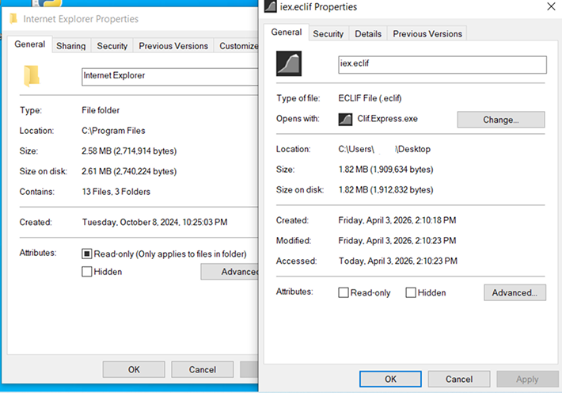

# Clif Express
Experimantal compresion software written in python

Download : [Clif.Express.exe](https://github.com/prankapple-alt/cliffexpress/releases/download/D/Clif.Express.exe)

Set **chunksize** to **8** for better results

## Test
Here i tried compressing the whole **Internet Explorer** folder in Program Files using chunksize **4** and got good results, look

